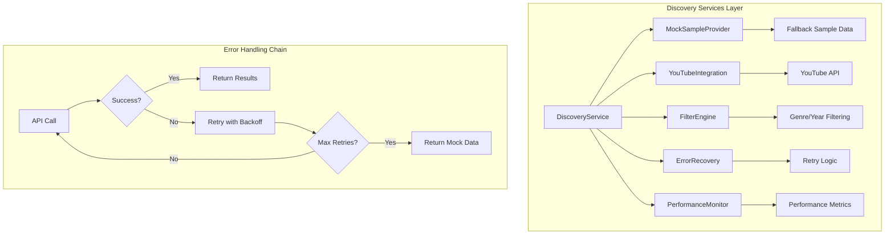

# Sample Discovery Feature Design

## Overview

The Sample Discovery Feature is a completely isolated page within The Chop Shop application that enables users to discover vintage samples (1950s-1990s) without affecting the core ChopperPage functionality. The design prioritizes complete separation, graceful error handling, and robust fallback mechanisms to prevent the issues encountered in previous implementations.

The architecture follows a strict isolation pattern where discovery functionality exists in its own route (/sample-discovery), uses dedicated components, maintains separate state, and implements comprehensive error boundaries to ensure zero impact on existing functionality.

## Architecture

### High-Level Architecture

```mermaid
graph TB
    subgraph "App Router"
        A[App.jsx] --> B[/sample-discovery Route]
        A --> C[/chopper Route - ChopperPage]
        A --> D[Other Routes]
    end
    
    subgraph "Discovery Feature (Isolated)"
        B --> E[SampleDiscoveryPage]
        E --> F[Discovery Components]
        E --> G[Discovery Services]
        E --> H[Discovery State]
    end
    
    subgraph "Existing Functionality (Untouched)"
        C --> I[ChopperPage Components]
        C --> J[Chopper Services]
        C --> K[Chopper State]
    end
    
    F -.->|No Direct Connection| I
    G -.->|No Shared Services| J
    H -.->|No Shared State| K
```

### Service Layer Architecture



## Components and Interfaces

### Page Structure

**SampleDiscoveryPage** - Main container component
- Route: `/sample-discovery`
- Completely isolated from ChopperPage
- Manages discovery-specific state
- Implements error boundaries
- Handles routing and navigation

### Core Components

**DiscoveryControls** - Filter and control interface
```jsx
interface DiscoveryControlsProps {
  filters: FilterState;
  onFilterChange: (filters: FilterState) => void;
  onShuffle: () => void;
  isLoading: boolean;
  error: string | null;
}
```

**SampleCard** - Individual sample display
```jsx
interface SampleCardProps {
  sample: SampleData;
  onPlay: (sample: SampleData) => void;
  onFavorite: (sample: SampleData) => void;
  isFavorite: boolean;
  isPlaying: boolean;
}
```

**DiscoveryVideoPlayer** - Dedicated YouTube player for discovery
```jsx
interface DiscoveryVideoPlayerProps {
  videoId: string;
  onReady: (player: YouTubePlayer) => void;
  onError: (error: Error) => void;
  onStateChange: (state: PlayerState) => void;
}
```

**FavoritesPanel** - Favorites management
```jsx
interface FavoritesPanelProps {
  favorites: SampleData[];
  onRemoveFavorite: (sampleId: string) => void;
  onPlayFavorite: (sample: SampleData) => void;
}
```

**HistoryPanel** - Discovery history tracking
```jsx
interface HistoryPanelProps {
  history: SampleData[];
  onClearHistory: () => void;
  onPlayFromHistory: (sample: SampleData) => void;
}
```

### Service Interfaces

**DiscoveryService** - Main service interface
```javascript
class DiscoveryService {
  async discoverSamples(filters) {
    // Returns Promise<SampleData[]>
  }
  
  async shuffleSamples(filters) {
    // Returns Promise<SampleData[]>
  }
  
  async getSampleMetadata(videoId) {
    // Returns Promise<SampleMetadata>
  }
}
```

**MockSampleProvider** - Fallback data provider
```javascript
class MockSampleProvider {
  generateMockSamples(filters, count = 12) {
    // Returns SampleData[]
  }
  
  getGenreSpecificSamples(genre) {
    // Returns SampleData[]
  }
  
  getYearRangeSamples(startYear, endYear) {
    // Returns SampleData[]
  }
}
```

## Data Models

### Core Data Types

**SampleData**
```javascript
interface SampleData {
  id: string;
  title: string;
  artist: string;
  year: number;
  genre: string;
  duration: number; // in seconds
  youtubeId: string;
  thumbnailUrl: string;
  tempo?: number; // BPM
  instruments?: string[];
  tags?: string[];
  isMock: boolean; // indicates if this is fallback data
}
```

**FilterState**
```javascript
interface FilterState {
  genres: string[];
  yearRange: {
    start: number;
    end: number;
  };
  tempoRange?: {
    min: number;
    max: number;
  };
  durationRange?: {
    min: number;
    max: number;
  };
  instruments?: string[];
}
```

**DiscoveryState**
```javascript
interface DiscoveryState {
  samples: SampleData[];
  currentSample: SampleData | null;
  filters: FilterState;
  favorites: SampleData[];
  history: SampleData[];
  isLoading: boolean;
  error: string | null;
  isOnline: boolean;
  useMockData: boolean;
}
```

### Storage Schema

**LocalStorage Structure**
```javascript
{
  "sampleDiscovery": {
    "favorites": SampleData[],
    "history": SampleData[],
    "lastFilters": FilterState,
    "preferences": {
      "autoPlay": boolean,
      "showAdvancedFilters": boolean
    }
  }
}
```

## Error Handling

### Error Boundary Strategy

**DiscoveryErrorBoundary** - Top-level error containment
- Catches all discovery-related errors
- Prevents errors from affecting ChopperPage
- Provides fallback UI with recovery options
- Logs errors for debugging

**Service-Level Error Handling**
```javascript
class ErrorRecoveryService {
  async withRetry(operation, maxRetries = 3) {
    // Implements exponential backoff
    // Falls back to mock data on failure
    // Provides user-friendly error messages
  }
  
  handleYouTubeAPIError(error) {
    // Specific handling for YouTube API errors
    // Rate limiting, quota exceeded, etc.
  }
  
  handleNetworkError(error) {
    // Network connectivity issues
    // Offline mode activation
  }
}
```

### Graceful Degradation Chain

1. **Primary**: YouTube API with real sample discovery
2. **Secondary**: Cached results from previous successful calls
3. **Tertiary**: Mock sample data with clear "demo mode" indication
4. **Fallback**: Static sample list with offline functionality

### Error User Experience

**Error States**
- Loading states with progress indicators
- Network error messages with retry buttons
- API failure notifications with fallback explanations
- Empty state handling with suggested actions

## Testing Strategy

### Component Testing
- Unit tests for all discovery components
- Mock service integration tests
- Error boundary testing
- Accessibility testing (ARIA, keyboard navigation)

### Service Testing
- YouTube API integration tests
- Mock data provider tests
- Error recovery scenario tests
- Performance benchmarking

### Integration Testing
- End-to-end discovery workflow tests
- Filter combination testing
- Favorites and history persistence tests
- Cross-browser compatibility tests

### Isolation Testing
- Verify zero impact on ChopperPage performance
- Memory leak detection
- State isolation verification
- Error propagation prevention tests

## Performance Considerations

### Optimization Strategies

**Lazy Loading**
- Components loaded only when discovery route is accessed
- Sample thumbnails loaded on demand
- Advanced filters loaded conditionally

**Caching Strategy**
```javascript
class DiscoveryCacheManager {
  cacheResults(filters, samples, ttl = 300000) {
    // Cache API results for 5 minutes
  }
  
  getCachedResults(filters) {
    // Return cached results if available and valid
  }
  
  invalidateCache() {
    // Clear cache on user request or error
  }
}
```

**Memory Management**
- Cleanup of unused sample data
- YouTube player instance management
- Event listener cleanup on unmount
- Image preloading optimization

### Performance Monitoring
```javascript
class DiscoveryPerformanceMonitor {
  trackPageLoad() {
    // Monitor initial page load time
  }
  
  trackFilterResponse() {
    // Monitor filter application performance
  }
  
  trackMemoryUsage() {
    // Monitor memory consumption
  }
}
```

## Security Considerations

### API Security
- YouTube API key protection via environment variables
- Rate limiting implementation
- Input sanitization for search queries
- CORS handling for external requests

### Data Privacy
- Local storage encryption for sensitive data
- No personal information in sample metadata
- Clear data retention policies
- User consent for data storage

## Deployment Strategy

### Feature Flags
```javascript
const FEATURE_FLAGS = {
  SAMPLE_DISCOVERY_ENABLED: process.env.VITE_SAMPLE_DISCOVERY_ENABLED === 'true',
  USE_MOCK_DATA: process.env.VITE_USE_MOCK_SAMPLE_DATA === 'true',
  ADVANCED_FILTERS: process.env.VITE_ADVANCED_FILTERS_ENABLED === 'true'
};
```

### Environment Configuration
```javascript
const DISCOVERY_CONFIG = {
  YOUTUBE_API_KEY: process.env.VITE_YOUTUBE_API_KEY,
  MAX_SAMPLES_PER_REQUEST: 12,
  CACHE_TTL: 300000, // 5 minutes
  MAX_RETRY_ATTEMPTS: 3,
  RETRY_DELAY_BASE: 1000 // 1 second
};
```

### Rollback Strategy
- Feature can be disabled via environment variable
- Graceful degradation to mock data
- Route can be conditionally rendered
- No database migrations required

## Monitoring and Analytics

### Key Metrics
- Discovery page load time
- Sample discovery success rate
- Filter usage patterns
- Error occurrence frequency
- User engagement metrics

### Logging Strategy
```javascript
class DiscoveryLogger {
  logDiscoveryAttempt(filters) {
    // Track discovery requests
  }
  
  logError(error, context) {
    // Track errors with context
  }
  
  logPerformance(metric, value) {
    // Track performance metrics
  }
}
```

This design ensures complete isolation from existing functionality while providing a robust, user-friendly sample discovery experience with comprehensive error handling and fallback mechanisms.