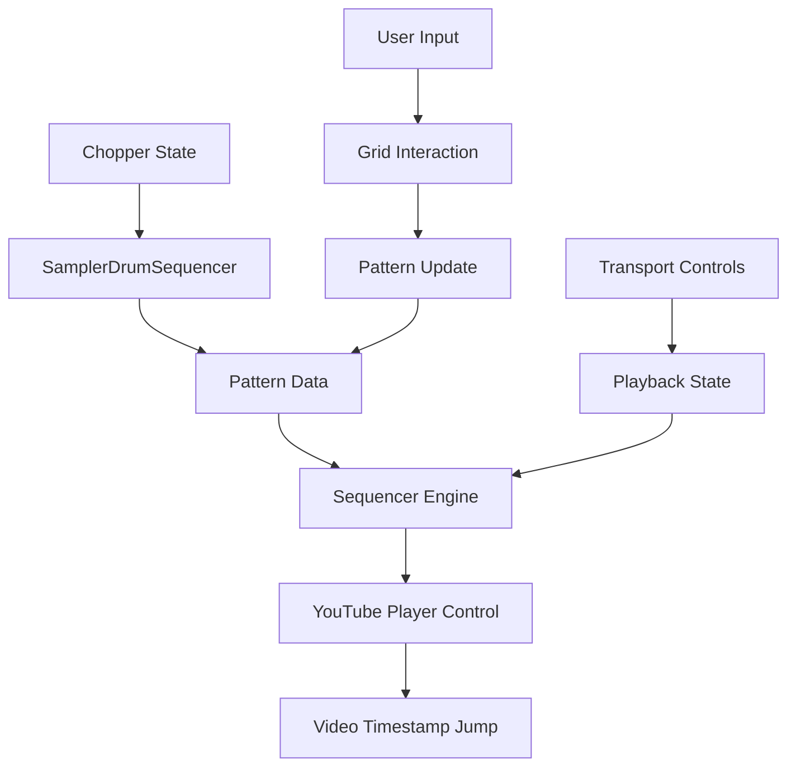

# Design Document

## Overview

The Sampler Drum Track Sequencer integrates into the existing Chopper Page as a new component that leverages YouTube chop timestamps as triggerable sounds in a sequencer-style interface. The design prioritizes performance, reuses existing efficient components, and maintains visual consistency with the current application architecture.

The sequencer operates as a trigger-only system that controls YouTube video playback rather than processing audio directly, making it lightweight and responsive. It builds upon the existing sequencer infrastructure while adapting it for the unique requirements of YouTube-based sampling.

## Architecture

### Component Hierarchy

```
ChopperPage
├── Existing Components (VideoPlayer, PadGrid, Controls, etc.)
└── SamplerDrumSequencer
    ├── SamplerTransportControls
    ├── SamplerSequencerGrid
    ├── SamplerBankNavigation
    └── SamplerTapTempo
```

### Integration Points

1. **Chop Data Integration**: The sequencer receives chop data from the existing chopper state management
2. **YouTube Player Integration**: Reuses the existing YouTube player instance for timestamp jumping
3. **Bank System Integration**: Leverages the existing activeBank state from the chopper system
4. **Performance Monitoring**: Integrates with existing performance monitoring systems

### Data Flow



## Components and Interfaces

### SamplerDrumSequencer (Main Component)

**Purpose**: Main container component that orchestrates the sequencer functionality

**Props**:
- `chops`: Array of chop objects from chopper state
- `activeBank`: Current bank identifier ('A', 'B', etc.)
- `youtubePlayer`: YouTube player instance
- `onBankChange`: Callback for bank switching

**State**:
- `isPlaying`: Boolean playback state
- `bpm`: Current tempo (60-200)
- `currentStep`: Current playhead position (0-15)
- `pattern`: 2D array representing trigger grid [track][step]
- `currentBank`: Current bank index (0-3, initially 0-1)

**Key Methods**:
- `handlePlay()`: Start/resume sequencer playback
- `handleStop()`: Stop playback and reset position
- `handleBpmChange(newBpm)`: Update tempo
- `handleStepToggle(track, step)`: Toggle trigger at position

### SamplerTransportControls

**Purpose**: Playback controls optimized for the sampler sequencer

**Props**:
- `isPlaying`: Current playback state
- `bpm`: Current BPM value
- `onPlay`: Play button callback
- `onStop`: Stop button callback
- `onBpmChange`: BPM change callback

**Features**:
- Simplified transport (Play/Stop only, no pause for simplicity)
- BPM input with validation (60-200 range)
- Visual playback state indicator
- Keyboard shortcuts (Space for play/stop)

### SamplerSequencerGrid

**Purpose**: 16x16 grid for pattern programming with performance optimizations

**Props**:
- `pattern`: Current pattern data
- `chops`: Available chops for current bank
- `currentStep`: Playhead position
- `isPlaying`: Playback state
- `onStepToggle`: Step toggle callback

**Features**:
- 16 tracks (rows) × 16 steps (columns) grid
- Visual track assignment indicators
- Current step highlighting
- Optimized rendering with React.memo
- Minimal visual effects for performance

**Performance Optimizations**:
- Virtualized rendering for large grids
- Memoized step components
- Debounced user interactions
- Efficient re-render strategies

### SamplerBankNavigation

**Purpose**: Navigation between chop banks

**Props**:
- `currentBank`: Active bank index
- `totalBanks`: Total available banks
- `onBankChange`: Bank change callback
- `chopsPerBank`: Chops available in each bank

**Features**:
- Simple arrow navigation (< Bank A/B >)
- Bank indicator with chop count
- Smooth transitions between banks
- Future expansion ready (up to 4 banks)

### SamplerTapTempo

**Purpose**: Minimal tap tempo functionality

**Props**:
- `onTempoCalculated`: Callback with calculated BPM
- `currentBpm`: Current BPM for display

**Features**:
- Small button with minimal footprint
- Space bar support for tapping
- 4-tap minimum for calculation
- Visual feedback on taps
- Auto-reset after inactivity (3 seconds)

### SamplerSequencerEngine (Service)

**Purpose**: Lightweight sequencer timing engine adapted from existing SequencerEngine

**Key Differences from Standard SequencerEngine**:
- No audio scheduling (YouTube player control only)
- Simplified timing requirements
- Reduced memory footprint
- Optimized for trigger-only operation

**Methods**:
- `start()`: Begin pattern playback
- `stop()`: Stop and reset playback
- `setBPM(bpm)`: Update tempo
- `onStep(callback)`: Register step callback
- `jumpToTimestamp(timestamp)`: Control YouTube player

## Data Models

### Pattern Data Structure

```javascript
{
  id: 'pattern_uuid',
  name: 'Pattern Name',
  bpm: 120,
  currentBank: 0,
  banks: [
    {
      bankId: 0,
      tracks: [
        {
          trackIndex: 0,
          chopId: 'A0', // Maps to chop pad ID
          steps: [true, false, false, false, ...] // 16 boolean values
        }
        // ... 15 more tracks
      ]
    }
    // ... more banks
  ]
}
```

### Chop Integration Model

```javascript
{
  // Existing chop structure
  padId: 'A0',
  startTime: 10.5,
  endTime: 12.3,
  color: '#06b6d4',
  
  // Sequencer extensions
  sequencerTrack: 0, // Auto-assigned track index
  isSequencerActive: true // Whether available for sequencing
}
```

### Bank Organization

```javascript
{
  banks: {
    0: { // Bank A (A0-A15)
      name: 'Bank A',
      chops: [...], // Chops A0-A15
      pattern: [...] // Pattern data for this bank
    },
    1: { // Bank B (B0-B15) 
      name: 'Bank B',
      chops: [...], // Chops B0-B15
      pattern: [...]
    }
    // Future: Banks C and D
  }
}
```

## Error Handling

### YouTube Player Integration Errors

**Error Types**:
- Player not ready
- Seek operation failures
- Network connectivity issues

**Handling Strategy**:
- Graceful degradation (continue sequencer, skip video jumps)
- User notification of playback issues
- Automatic retry mechanisms
- Fallback to audio-only mode if available

### Timing and Performance Errors

**Error Types**:
- Timing drift
- High latency operations
- Memory pressure

**Handling Strategy**:
- Performance monitoring integration
- Automatic quality adjustment
- User warnings for performance issues
- Graceful degradation of visual effects

### Pattern Data Errors

**Error Types**:
- Invalid pattern data
- Bank switching failures
- Chop assignment conflicts

**Handling Strategy**:
- Data validation and sanitization
- Default pattern fallbacks
- User-friendly error messages
- State recovery mechanisms

## Testing Strategy

### Unit Testing

**Components to Test**:
- SamplerTransportControls: BPM validation, play/stop logic
- SamplerSequencerGrid: Step toggling, pattern updates
- SamplerBankNavigation: Bank switching logic
- SamplerTapTempo: Tempo calculation accuracy

**Test Coverage**:
- Input validation (BPM ranges, pattern bounds)
- State management (playback states, pattern updates)
- Error conditions (invalid inputs, missing data)
- Performance benchmarks (render times, memory usage)

### Integration Testing

**Integration Points**:
- Chopper state integration
- YouTube player control
- Existing sequencer service reuse
- Bank system coordination

**Test Scenarios**:
- Chop creation → sequencer track assignment
- Pattern playback → YouTube timestamp jumping
- Bank switching → pattern preservation
- Performance under load

### Performance Testing

**Metrics to Monitor**:
- Grid render performance (target: <16ms per frame)
- Pattern update latency (target: <5ms)
- Memory usage (target: <50MB additional)
- Timing accuracy (target: ±1ms)

**Load Testing**:
- Complex patterns (all 16 tracks active)
- Rapid user interactions
- Extended playback sessions
- Multiple bank switches

### User Acceptance Testing

**Test Scenarios**:
- Create chops and sequence them
- Switch between banks while playing
- Use tap tempo to set BPM
- Verify YouTube video synchronization
- Test keyboard shortcuts

**Success Criteria**:
- Intuitive workflow from chopping to sequencing
- Responsive grid interactions
- Accurate tempo and timing
- Seamless YouTube integration
- No performance degradation

## Performance Considerations

### Rendering Optimizations

1. **Grid Virtualization**: Only render visible grid cells
2. **Component Memoization**: Prevent unnecessary re-renders
3. **Event Debouncing**: Batch rapid user interactions
4. **Minimal DOM Updates**: Use efficient update strategies

### Memory Management

1. **Pattern Data Efficiency**: Compact data structures
2. **Event Listener Cleanup**: Proper cleanup on unmount
3. **YouTube Player Reuse**: Leverage existing player instance
4. **Garbage Collection**: Minimize object creation in hot paths

### Timing Precision

1. **Web Audio Context**: Use high-resolution timing
2. **RequestAnimationFrame**: Smooth visual updates
3. **Worker Threads**: Offload heavy computations (future)
4. **Timing Compensation**: Account for system latency

### Integration Efficiency

1. **Service Reuse**: Leverage existing sequencer infrastructure
2. **State Sharing**: Minimize data duplication
3. **Event Coordination**: Efficient communication between components
4. **Resource Sharing**: Reuse audio context and other resources

## Future Expansion Considerations

### Additional Banks (C and D)

- Extend bank navigation to 4 banks
- Update data models for 64 total chops
- Maintain performance with larger datasets

### Advanced Sequencer Features

- Step velocity control
- Pattern length variations
- Swing/groove settings
- Pattern chaining

### Enhanced YouTube Integration

- Multiple video support
- Crossfading between chops
- Video effects synchronization
- Offline mode with cached audio

### Performance Enhancements

- Web Workers for pattern processing
- WebAssembly for timing-critical code
- Advanced caching strategies
- Progressive loading for large patterns